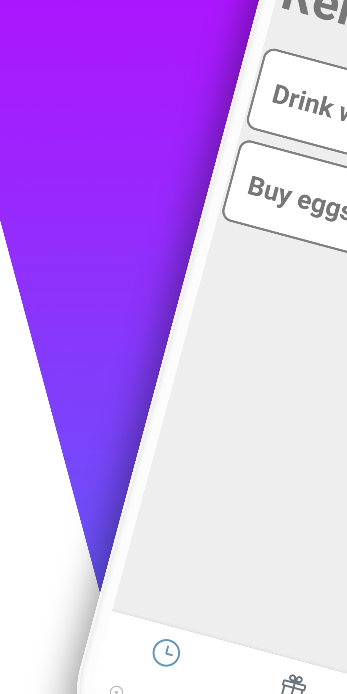
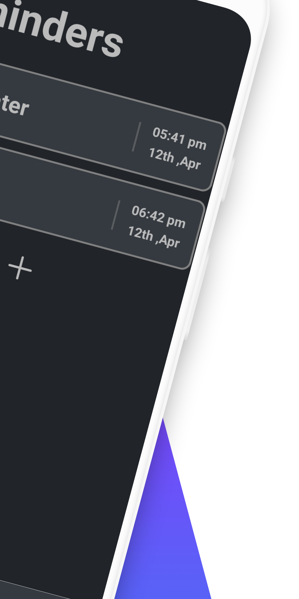
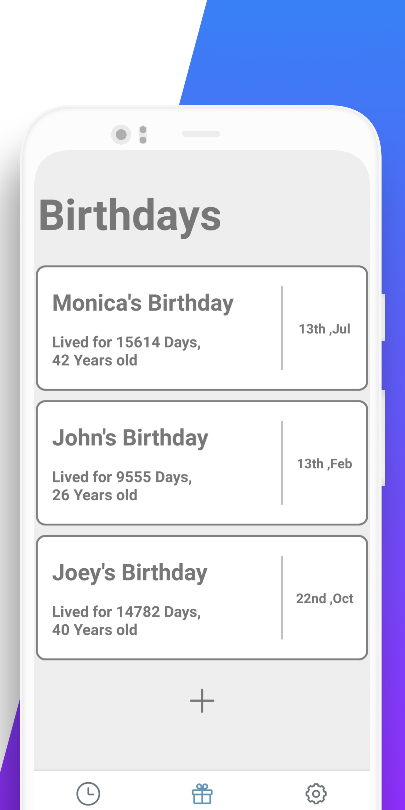
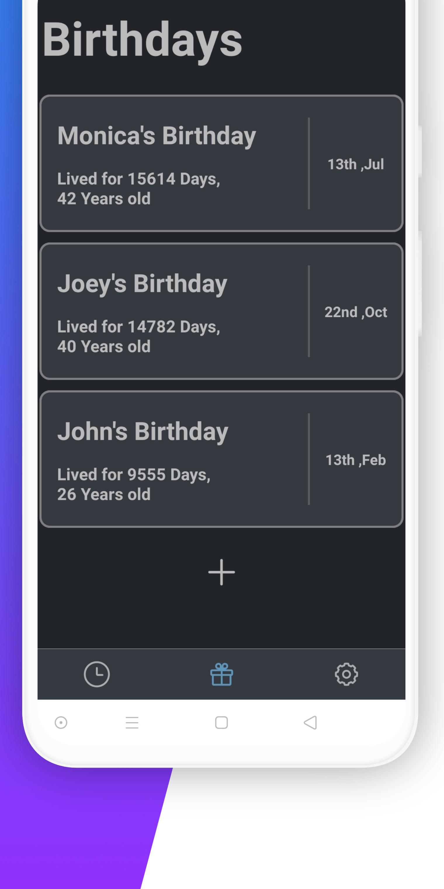

# Reminder App

## Table of Contents

- [About](#about)
- [Getting Started](#getting_started)
- [Features](#features)

## About

it's a simple reminder app made with React-Native and Expo.

## Getting Started

- Install dependencies: `yarn install` (or `npm install`).

- Run on both Android & iOS: `expo start` (or `npm start`).

- Run on Android: `yarn android` (or `npm run android`).

- Run on iOS: `yarn ios` (or `npm run ios`).

### Preview

## Features

- Notification Support
- Local Storage
- Dark theme and light theme
- Minimal design
- Birthday Reminders
- and much more..

## Testing

- it has been Tested on Android 10.0
- it uses expo SDK 40
- if you find any bugs, please raise an issue

## License

This project is licensed under the MIT License - see the [LICENSE.md](LICENSE.md) file for details

## Thank You

Thanks for checking out my project, feel free to fork it.
